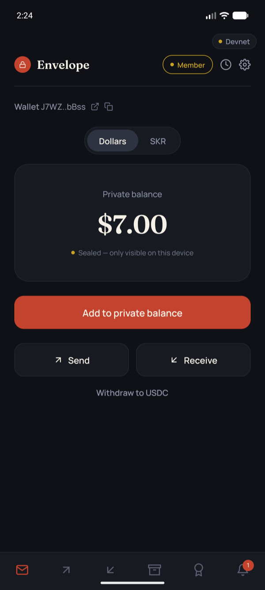
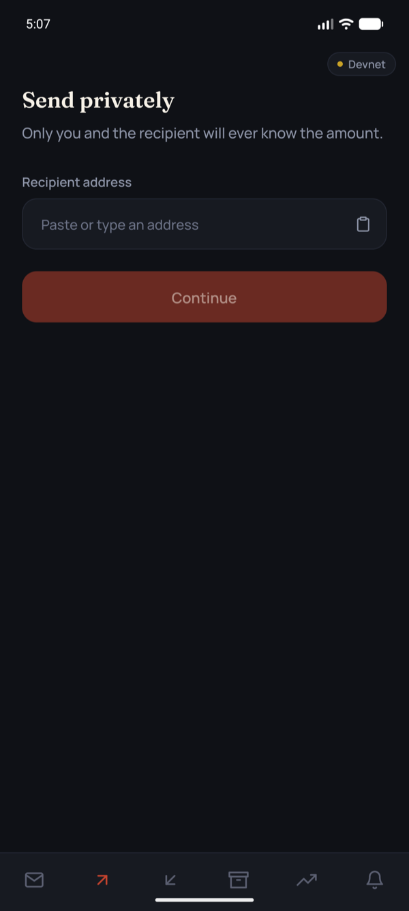
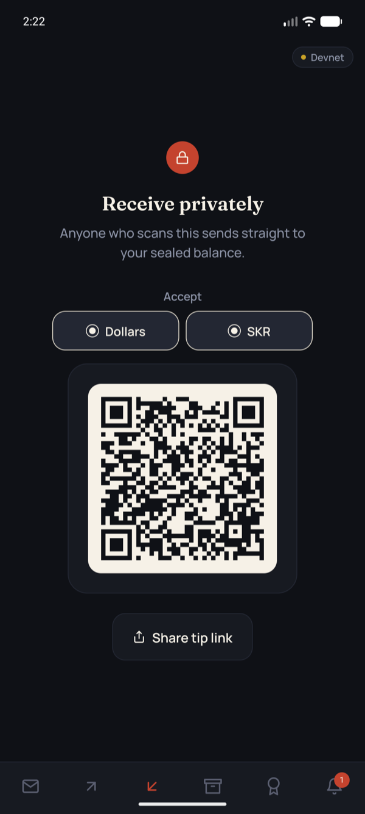
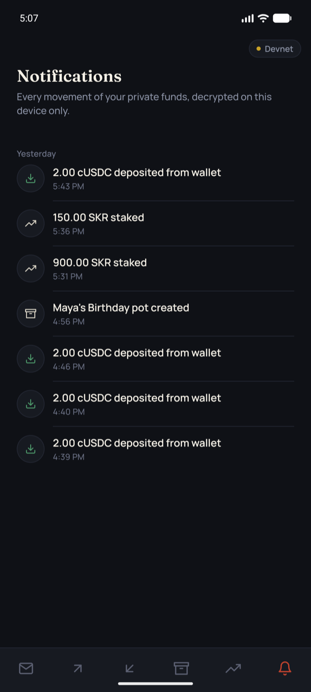
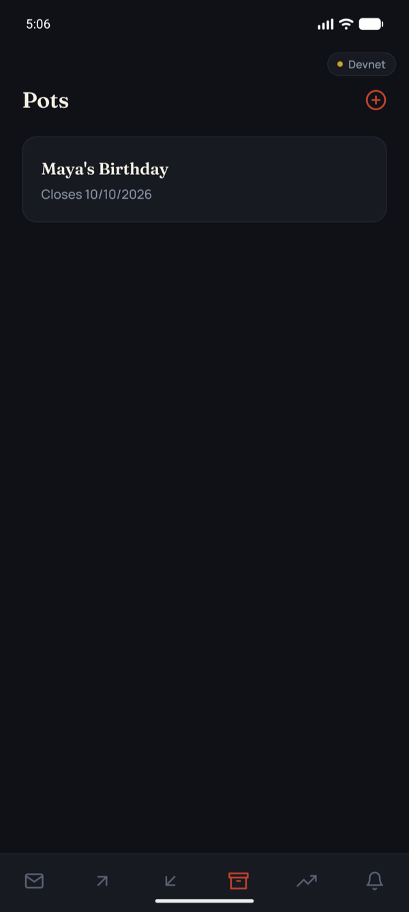
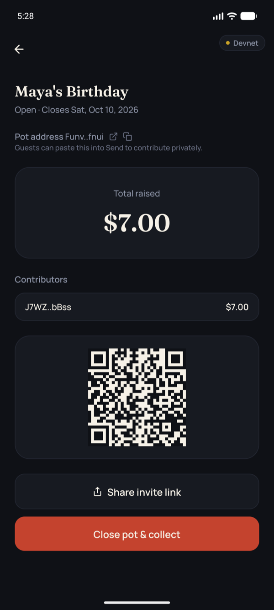
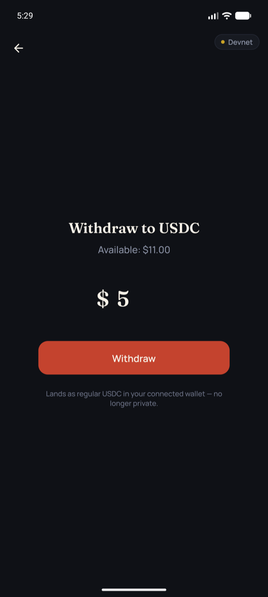
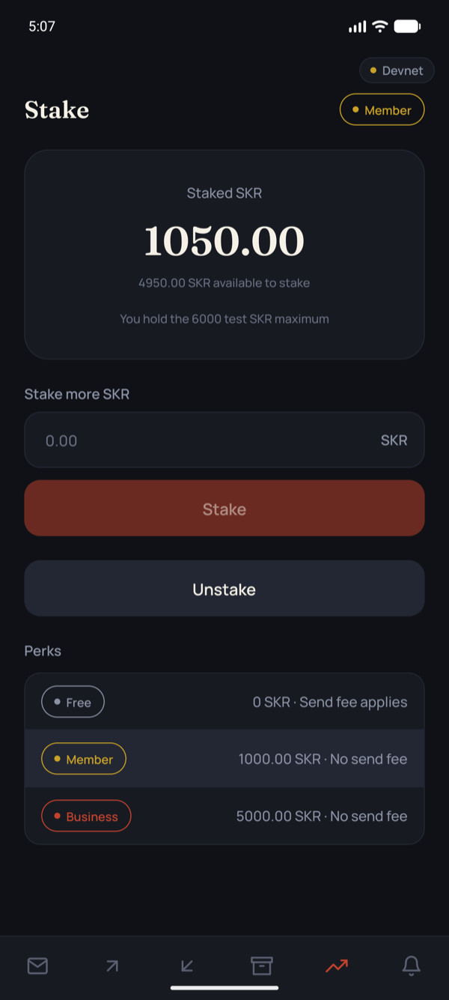
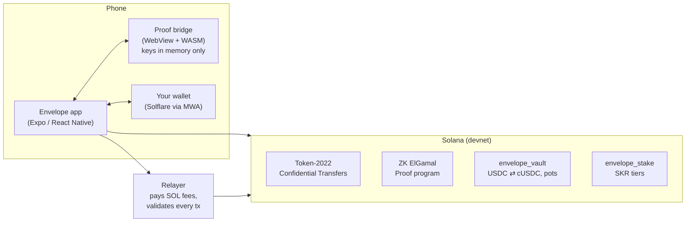

# Envelope

**Private payments on Solana. Your balance is sealed — only you can open it.**

Envelope is an Android wallet companion for sending dollars privately on Solana. Balances and transfer amounts are encrypted on-chain with Token-2022 Confidential Transfers; the zero-knowledge proofs are generated on your phone, the keys never leave it, and you never need SOL to send.

`Solana devnet` · `Android + Mobile Wallet Adapter` · `Token-2022 Confidential Transfers` · `Anchor` · `Expo` · `Apache-2.0`

---

## The problem

Every Solana payment is public. Pay a friend for dinner and they — and anyone with a block explorer — can see your entire balance and every transfer you've ever made. That's a non-starter for salaries, group gifts, donations, or any payment between people who don't want to publish their finances.

## What Envelope does

- **Private balance** — wrap USDC 1:1 into cUSDC, a confidential token. Your balance is stored on-chain as ciphertext; only your device can decrypt it.
- **Send privately** — the amount is encrypted end to end; only you and the recipient can read it. A relayer pays the SOL network fee, so senders never need SOL.
- **Receive** — share your address as a QR code or a tip link; incoming transfers are applied to your balance automatically.
- **Event pots** — sealed group gifts (a wedding, a farewell): guests contribute privately, the host sees the total, and guests never see each other's amounts.
- **Withdraw** — turn private cUSDC back into spendable USDC in one approval.
- **Staking tiers** — stake SKR to raise your daily limit and drop the send fee.
- **Notifications** — every movement of your funds, decrypted on-device: deposits, withdrawals, transfers, pot activity.
- **Biometric unlock** — reopening the app restores your keys behind your fingerprint, with no new wallet prompt.

## Screenshots

<table>
  <tr>
    <td align="center"><br /><sub><b>Home</b> — your sealed balance</sub></td>
    <td align="center"><br /><sub><b>Send</b> — amount known only to you and the recipient</sub></td>
    <td align="center"><br /><sub><b>Receive</b> — QR code and tip link</sub></td>
    <td align="center"><br /><sub><b>Notifications</b> — every movement of your funds</sub></td>
  </tr>
  <tr>
    <td align="center"><br /><sub><b>Pots</b> — sealed group gifts</sub></td>
    <td align="center"><br /><sub><b>Pot</b> — host sees the total; guests see only their own</sub></td>
    <td align="center"><br /><sub><b>Withdraw</b> — back to regular USDC in one approval</sub></td>
    <td align="center"><br /><sub><b>Stake</b> — SKR tiers and perks</sub></td>
  </tr>
</table>

## How it works



1. **Keys from one signature.** Your wallet signs a fixed message once; Envelope derives your encryption keys (ElGamal + AES) from it. They live only in memory on your device — the signature is stored behind your fingerprint so the app can rebuild them when you reopen it.
2. **Proofs on the phone.** Confidential transfers need zero-knowledge proofs (equality, ciphertext validity, range). Envelope generates them on-device with Solana's `zk-sdk` compiled to WebAssembly, running in a locked-down WebView (React Native's JS engine has no WebAssembly).
3. **Your wallet signs, nothing more.** Every transaction is signed in your own wallet through Mobile Wallet Adapter. Envelope never holds a wallet private key.
4. **A relayer pays the gas.** Private sends are relayed: the relayer co-signs as fee payer only after checking every instruction against a strict policy, so it can't be drained or tricked into moving its own funds.
5. **Programs enforce the rules.** `envelope_vault` wraps USDC into cUSDC 1:1, enforces daily limits by tier, and runs event pots; `envelope_stake` holds SKR stakes and computes tiers that both the vault and the relayer read.

## Privacy, honestly

"Private" here means **amount-private**, not anonymous.

| Who                        | Sees amounts?        | Sees who paid whom? |
| -------------------------- | -------------------- | ------------------- |
| You and the person you pay | Yes                  | Yes                 |
| A pot's host               | Yes, for that pot    | Yes                 |
| Other pot guests           | No                   | No                  |
| The relayer                | No                   | Yes                 |
| Anyone watching the chain  | No — only ciphertext | Yes                 |

Wallet addresses and the fact that a transfer happened are public; only amounts and balances are hidden. The full analysis — relayer trust, linkability, key storage, and audit findings — is in [THREAT_MODEL.md](THREAT_MODEL.md).

## Tiers

Stake SKR to unlock more. Tiers are computed on-chain from your stake and enforced by both the vault program and the relayer.

| Tier     | SKR staked | Add to private balance | Private sends            |
| -------- | ---------- | ---------------------- | ------------------------ |
| Free     | —          | 100 USDC / day         | 0.001 SKR fee to relayer |
| Member   | 1,000      | 10,000 USDC / day      | No fee                   |
| Business | 5,000      | Unlimited              | No fee                   |

On devnet, the Stake tab has a test-SKR faucet (500 SKR a day, up to 6,000 held).

## Deployed on devnet

| Component            | Address                                        |
| -------------------- | ---------------------------------------------- |
| `envelope_vault`     | `43kwURZxpDniSpWPSfxyqUSc3kwuaCEmAJmSKtqdxMXi` |
| `envelope_stake`     | `331WWNPRsoCJToHMrsbGPUC338DfqYEbMhiECL9jFqfx` |
| cUSDC (confidential) | `8wc4rgUPj4a2542YpgrjaxXW9XzBFZA1PLSvdNXmkjsf` |
| USDC (Circle devnet) | `4zMMC9srt5Ri5X14GAgXhaHii3GnPAEERYPJgZJDncDU` |
| SKR (test token)     | `5m3R8bdAZr5xMg7ioMXoPabsKGcRPAWLu2muzyUNzRKY` |

The app reads these from [`config/devnet.json`](config/devnet.json), so it runs against the deployed programs out of the box.

## Getting started

### Prerequisites

- Node.js 22+
- An Android device or emulator (Android Studio). Envelope is Android-only: Mobile Wallet Adapter is an Android protocol.
- A devnet wallet that supports Mobile Wallet Adapter — e.g. [Solflare](https://solflare.com) switched to devnet.
- For working on the programs only: [Rust](https://www.rust-lang.org/tools/install), the [Solana CLI](https://solana.com/docs/intro/installation), and [Anchor](https://www.anchor-lang.com/docs/installation).

### Run it

```bash
npm install
cp .env.example .env                # add a Helius devnet API key (helius.dev) — optional, avoids public-RPC rate limits
cp relayer/.env.example relayer/.env
npm run devnet:keys                 # devnet keypairs for the relayer and test wallets → .keys/ (gitignored)
npm run devnet:airdrop              # fund them with devnet SOL

npm run relayer:dev                 # terminal 1: relayer on :8787
npm run android                     # terminal 2: first time only — builds and installs the dev client
npm run dev                         # afterwards: start Metro, then press `a`
```

Then, in the app: connect your wallet, tap **Enable private balance**, and approve. Get devnet USDC for your wallet at [faucet.circle.com](https://faucet.circle.com) and devnet SOL at [faucet.solana.com](https://faucet.solana.com), then **Add to private balance**.

<details>
<summary><strong>Troubleshooting</strong></summary>

- **`EMFILE: too many open files` when starting Metro (macOS)** — add `ulimit -n 10240` to `~/.zshrc`, and make sure Watchman works (`watchman watch-project .`). If file watching fails everywhere, stop stray `tsx watch` / dev-server processes or restart the machine.
- **Emulator fingerprint prompt** — enroll a fingerprint in Android Settings → Security, then use the emulator's Extended Controls → Fingerprint to touch the sensor.
- **"Can't connect to the network" right after returning from the wallet** — Android briefly blocks a backgrounded app's network; Envelope retries automatically. If it persists, cold-boot the emulator.
- **Wallet shows a black screen on Connect** — force-stop the wallet app and tap Connect again.

</details>

## Project structure

```
├── src/                     Expo app (Expo Router screens in src/app, features in src/features)
├── packages/
│   ├── cbridge/             proof bridge: Token-2022 confidential + zk-sdk, bundled into one HTML file for a WebView
│   └── rn-confidential/     React Native host for the bridge (<CBridgeHost>, useCBridge)
├── anchor/programs/
│   ├── envelope_vault/      USDC ⇄ cUSDC wrap/unwrap, daily limits by tier, event pots
│   └── envelope_stake/      SKR staking and tier computation
├── relayer/                 fee-payer service: transaction policy, tiers, push webhooks, devnet SKR faucet
├── scripts/                 devnet setup and end-to-end round-trip scripts
└── config/devnet.json       public devnet addresses (programs, mints, wallets)
```

## Useful commands

| Command                                | What it does                                                        |
| -------------------------------------- | ------------------------------------------------------------------- |
| `npm run dev`                          | Start Metro for the dev client                                      |
| `npm run relayer:dev`                  | Run the relayer locally (port 8787)                                 |
| `npm run cbridge:build`                | Rebuild the proof bridge bundle after changing `packages/cbridge`   |
| `npm run devnet:roundtrip`             | CLI confidential transfer round trip on devnet                      |
| `npm run devnet:withdraw-roundtrip`    | Wrap → confidential → withdraw → unwrap, checking supply invariants |
| `npm run devnet:pot-roundtrip`         | Event pot lifecycle, including a guest-privacy negative check       |
| `npm run relayer:test-policy`          | Check the relayer rejects a malicious tx and relays a valid one     |
| `npm run anchor:build` / `anchor:test` | Build / test the Anchor programs                                    |
| `npm run codama:js`                    | Regenerate the typed program clients from the IDLs                  |
| `npm run ci`                           | Typecheck, lint, format check, and Android prebuild                 |

## Design decisions

- **Proofs in a WebView, not a server.** Generating proofs on-device keeps encryption keys on the phone. Hermes has no WebAssembly, so the zk-sdk runs in a sandboxed WebView with no network navigation or file access, talking to the app over a small RPC channel.
- **Wallet-agnostic signing.** Real wallets modify what they sign (Solflare adds priority-fee instructions), so the bridge adopts the wallet's returned transaction rather than assuming its own bytes were signed.
- **One approval per action, nothing left to expire.** Proof setup is signed without a wallet prompt — by the relayer for sends, or by a small device-derived "gas tank" for withdrawals and pots — and lands first; you then approve a single transaction built on a fresh blockhash.
- **A relayer that can't be drained.** Every relayed instruction is checked against an allow-list with exact discriminators, account-role checks, and a priority-fee cap — tested by a fuzz script that throws drain attempts at it.

## Security & limitations

Envelope runs on **devnet only** and has not been externally audited. Known limitations, all documented in [THREAT_MODEL.md](THREAT_MODEL.md):

- Who paid whom is public; only amounts are hidden.
- The relayer sees sender and recipient (never amounts).
- Mainnet would first require revoking the confidential mint's authority and the other pre-launch steps listed in the threat model.
- Push notifications need an EAS project (`eas init`); everything else works without one.

## License

[Apache-2.0](LICENSE)
