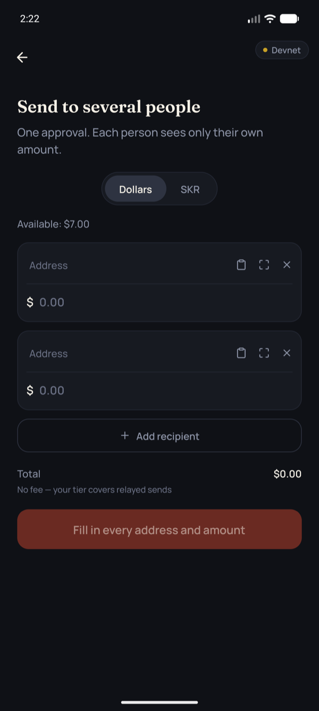
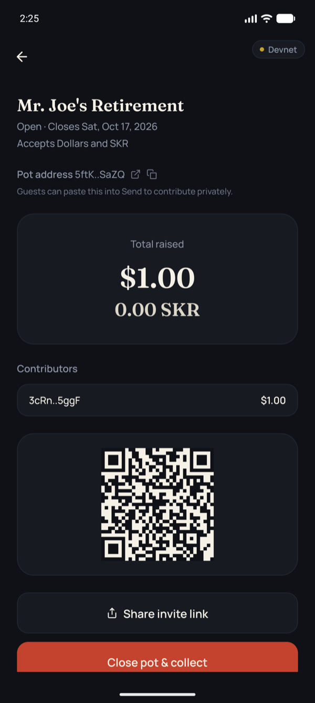
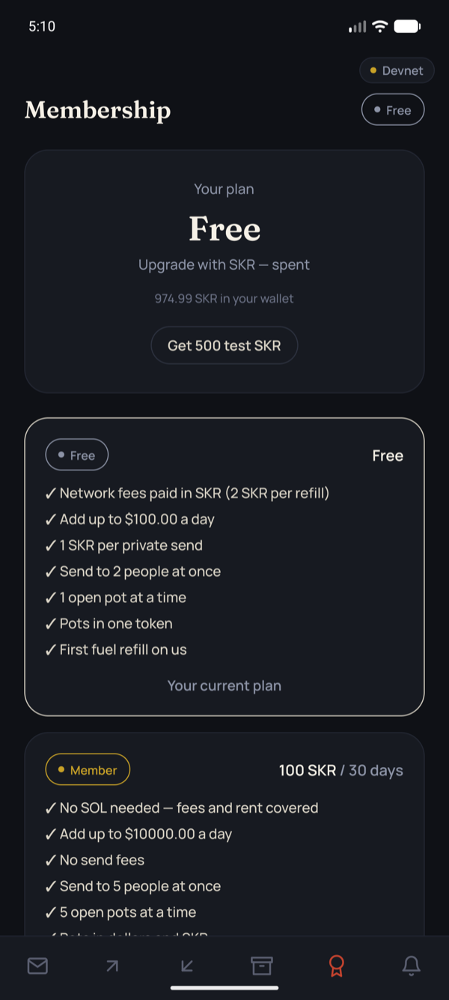
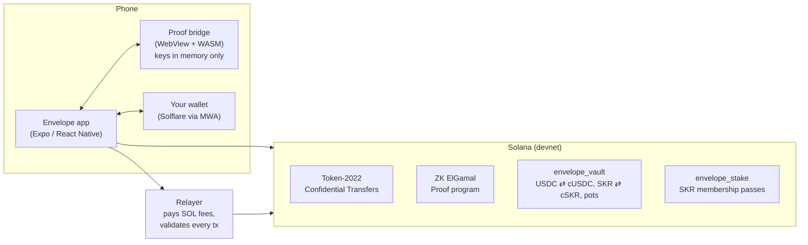

# Envelope

**Private payments on Solana. Your balance is sealed — only you can open it.**

Envelope is an Android wallet companion for holding and sending dollars and SKR privately on Solana. Balances and transfer amounts are encrypted on-chain with Token-2022 Confidential Transfers; the zero-knowledge proofs are generated on your phone, the keys never leave it, and SKR pays every network fee — your wallet never needs SOL.

`Solana devnet` · `Android + Mobile Wallet Adapter` · `Token-2022 Confidential Transfers` · `Anchor` · `Expo` · `Apache-2.0`

---

## The problem

By default, every Solana payment is public. Pay a friend for dinner and they — and anyone with a block explorer — can see how much you sent, your entire balance, and every transfer you've ever made. Some wallets can now hide _who_ sent a payment, but the amount and your balance stay on display. That's a non-starter for salaries, group gifts, donations, or any payment between people who don't want to publish their finances.

## What Envelope does

- **Private balances in dollars and SKR** — wrap USDC 1:1 into cUSDC, or SKR 1:1 into cSKR, both confidential tokens. Balances are stored on-chain as ciphertext; only your device can decrypt them. Switch between them on Home.
- **Send privately** — the amount is encrypted end to end; only you and the recipient can read it. A relayer pays the SOL network fee, so senders never need SOL. Scan any Envelope or Solana wallet QR code to fill in the recipient.
- **Batch send** — pay up to 20 people in one approval (payroll, splitting a bill). Each person sees only their own amount.
- **Receive** — share your address as a QR code or a tip link; incoming transfers are applied to your balance automatically.
- **Event pots** — sealed group gifts (a wedding, a farewell) in dollars, SKR, or both: guests contribute privately, the host sees the totals, and guests never see each other's amounts.
- **Withdraw** — turn private cUSDC or cSKR back into spendable USDC or SKR in one approval.
- **Ask for the token you want** — your Receive code says whether you take dollars, SKR, or both; the payer's app only offers those.
- **Membership in SKR** — a pass bought with SKR (not staked): Free, Member and Business plans with higher limits, no send fees, bigger batches and more pots.
- **No SOL, ever** — a device-derived gas tank pays rent and network fees, refuelled by the relayer for SKR (free for members, and the first refill is free for everyone). A brand-new wallet with zero SOL can do everything.
- **Notifications** — every movement of your funds, decrypted on-device: deposits, withdrawals, transfers, pot activity.
- **Biometric unlock** — reopening the app restores your keys behind your fingerprint, with no new wallet prompt.
- **Restore on any phone** — keys are re-derived from your wallet, and your open pots are found on-chain, so a reinstall or a new device picks up where you left off.
- **Runs on older phones too** — the proof engine is rebuilt to work on WebViews back to Chrome 85, including Huawei and other phones without Google services.

## Screenshots

<table>
  <tr>
    <td align="center"><br /><sub><b>Home</b> — your sealed balance</sub></td>
    <td align="center"><br /><sub><b>Send</b> — amount known only to you and the recipient</sub></td>
    <td align="center"><br /><sub><b>Batch send</b> — several people, one approval</sub></td>
    <td align="center"><br /><sub><b>Receive</b> — QR code and tip link</sub></td>
  </tr>
  <tr>
    <td align="center"><br /><sub><b>Pots</b> — sealed group gifts</sub></td>
    <td align="center"><br /><sub><b>Pot</b> — host sees the total; guests see only their own</sub></td>
    <td align="center"><br /><sub><b>Two-token pot</b> — collects dollars and SKR</sub></td>
    <td align="center"><br /><sub><b>Notifications</b> — every movement of your funds</sub></td>
  </tr>
  <tr>
    <td align="center"><br /><sub><b>Withdraw</b> — back to regular USDC or SKR</sub></td>
    <td align="center"><br /><sub><b>Membership</b> — Free, Member and Business plans, paid in SKR</sub></td>
  </tr>
</table>

## How it works



1. **Keys from one signature.** Your wallet signs a fixed message once; Envelope derives your encryption keys (ElGamal + AES) from it. They live only in memory on your device — the signature is stored behind your fingerprint so the app can rebuild them when you reopen it.
2. **Proofs on the phone.** Confidential transfers need zero-knowledge proofs (equality, ciphertext validity, range). Envelope generates them on-device with Solana's `zk-sdk` compiled to WebAssembly, running in a locked-down WebView (React Native's JS engine has no WebAssembly).
3. **Your wallet signs, nothing more.** Every transaction is signed in your own wallet through Mobile Wallet Adapter. Envelope never holds a wallet private key.
4. **SKR pays the gas.** Private sends are relayed: the relayer co-signs as fee payer only after checking every instruction against a strict policy, so it can't be drained or tricked into moving its own funds. Everything else — account setup, deposits, withdrawals, pots, passes — is paid by a gas tank derived from your wallet, which the relayer refuels for SKR.
5. **Programs enforce the rules.** `envelope_vault` wraps USDC into cUSDC and SKR into cSKR 1:1, enforces daily dollar limits by tier, and runs event pots; `envelope_stake` sells SKR membership passes (and still honors older stakes) and computes the tier both the vault and the relayer read.

## Privacy, honestly

"Private" here means **amount-private**, not anonymous.

| Who                        | Sees amounts?        | Sees who paid whom? |
| -------------------------- | -------------------- | ------------------- |
| You and the person you pay | Yes                  | Yes                 |
| A pot's host               | Yes, for that pot    | Yes                 |
| Other pot guests           | No                   | No                  |
| The relayer                | No                   | Yes                 |
| Anyone watching the chain  | No — only ciphertext | Yes                 |

Wallet addresses and the fact that a transfer happened are public; only amounts and balances are hidden. The full analysis — relayer trust, linkability, key storage, and audit findings — is in [THREAT_MODEL.md](THREAT_MODEL.md).

## Membership and SKR fuel

SKR runs Envelope. A **membership pass** is bought with SKR — spent, not staked — and the tier is enforced on-chain by the vault (daily limits) and by the relayer (fees, batch size).

| Plan     | Price             | Network fees and rent            | Add dollars a day | Send fee | Batch send | Open pots | Pots in dollars + SKR |
| -------- | ----------------- | -------------------------------- | ----------------- | -------- | ---------- | --------- | --------------------- |
| Free     | —                 | 2 SKR per refill (first is free) | 100 USDC          | 1 SKR    | 2 people   | 1         | —                     |
| Member   | 100 SKR / 30 days | Included                         | 10,000 USDC       | None     | 5 people   | 5         | ✓                     |
| Business | 500 SKR / 30 days | Included                         | Unlimited         | None     | 20 people  | Unlimited | ✓                     |

**You never need SOL.** Each device has a gas tank — a keypair derived from your wallet, like your encryption keys — that pays rent and network fees for account setup, deposits, withdrawals, pots and passes. When it runs low, the relayer refuels it with SOL: free for members, 2 SKR otherwise, and every wallet's first refill is on the house so a new user can start with nothing. Private sends are paid by the relayer directly. Wallets that hold SOL can still top the tank up themselves.

On devnet, the Membership tab has a test-SKR faucet (500 SKR a day, up to 6,000 held). Older SKR stakes still count toward the tier until withdrawn.

## Deployed on devnet

| Component            | Address                                        |
| -------------------- | ---------------------------------------------- |
| `envelope_vault`     | `43kwURZxpDniSpWPSfxyqUSc3kwuaCEmAJmSKtqdxMXi` |
| `envelope_stake`     | `331WWNPRsoCJToHMrsbGPUC338DfqYEbMhiECL9jFqfx` |
| cUSDC (confidential) | `8wc4rgUPj4a2542YpgrjaxXW9XzBFZA1PLSvdNXmkjsf` |
| cSKR (confidential)  | `2682Tp4wUvDPR3hkNPirinSUNLVYhytS7mZGzgSNRXUU` |
| USDC (Circle devnet) | `4zMMC9srt5Ri5X14GAgXhaHii3GnPAEERYPJgZJDncDU` |
| SKR (test token)     | `5m3R8bdAZr5xMg7ioMXoPabsKGcRPAWLu2muzyUNzRKY` |

The app reads these from [`config/devnet.json`](config/devnet.json), so it runs against the deployed programs out of the box.

## Install the app

Download `envelope.apk` from the [Releases](https://github.com/ETIM-PAUL/Envelope/releases) page and open it on an Android phone (allow installs from your browser or file manager when asked), or install it over USB with `adb install envelope.apk`.

Then:

1. Install a Mobile Wallet Adapter wallet such as [Solflare](https://solflare.com) and switch it to **Devnet**.
2. Get devnet USDC at [faucet.circle.com](https://faucet.circle.com). No SOL needed — Envelope's first fuel refill is free, and test SKR comes from the faucet on the Membership tab.
3. Open Envelope, connect your wallet, tap **Enable private balance** (sets up private dollars and SKR in one approval), then **Add to private balance**.

The APK talks to the deployed devnet programs and a hosted relayer, so nothing else needs to run. The relayer is on a free tier that sleeps when idle: the first request after a quiet spell can take up to a minute.

## Getting started

### Prerequisites

- Node.js 22+
- An Android device or emulator (Android Studio). Envelope is Android-only: Mobile Wallet Adapter is an Android protocol.
- A devnet wallet that supports Mobile Wallet Adapter — e.g. [Solflare](https://solflare.com) switched to devnet.
- For working on the programs only: [Rust](https://www.rust-lang.org/tools/install), the [Solana CLI](https://solana.com/docs/intro/installation), and [Anchor](https://www.anchor-lang.com/docs/installation).

### Run it

```bash
npm install
cp .env.example .env                # add a Helius devnet API key (helius.dev) — optional, avoids public-RPC rate limits
cp relayer/.env.example relayer/.env
npm run devnet:keys                 # devnet keypairs for the relayer and test wallets → .keys/ (gitignored)
npm run devnet:airdrop              # fund them with devnet SOL

npm run relayer:dev                 # terminal 1: relayer on :8787
npm run android                     # terminal 2: first time only — builds and installs the dev client
npm run dev                         # afterwards: start Metro, then press `a`
```

Then, in the app: connect your wallet, tap **Enable private balance**, and approve. Get devnet USDC for your wallet at [faucet.circle.com](https://faucet.circle.com) and devnet SOL at [faucet.solana.com](https://faucet.solana.com), then **Add to private balance**.

### Build a release APK

A release build runs without Metro, so it needs a relayer reachable over HTTPS. Set it in `.env`:

```bash
EXPO_PUBLIC_RELAYER_URL=https://your-relayer.example.com
```

Create a signing key once (keep it: every update, including on the Solana dApp Store, must be signed with the same key):

```bash
keytool -genkeypair -storetype PKCS12 -keystore .keys/envelope-release.jks -alias envelope \
  -keyalg RSA -keysize 2048 -validity 10000 -dname "CN=Envelope"
printf '%s' '<the keystore password>' > .keys/envelope-release.password
```

Then `npm run android:apk` builds and signs `dist/envelope.apk`.

### Deploy the relayer

The repo includes a Dockerfile ([`relayer/Dockerfile`](relayer/Dockerfile)) and a [Render](https://render.com) blueprint ([`render.yaml`](render.yaml)): New → Blueprint → this repo. Set `RELAYER_KEYPAIR` to the contents of `.keys/relayer.json` and, optionally, `HELIUS_DEVNET_RPC_URL`. Any Docker host works the same way: build with `docker build -f relayer/Dockerfile .` from the repo root.

<details>
<summary><strong>Troubleshooting</strong></summary>

- **`EMFILE: too many open files` when starting Metro (macOS)** — add `ulimit -n 10240` to `~/.zshrc`, and make sure Watchman works (`watchman watch-project .`). If file watching fails everywhere, stop stray `tsx watch` / dev-server processes or restart the machine.
- **Emulator fingerprint prompt** — enroll a fingerprint in Android Settings → Security, then use the emulator's Extended Controls → Fingerprint to touch the sensor.
- **"Can't connect to the network" right after returning from the wallet** — Android briefly blocks a backgrounded app's network; Envelope retries automatically. If it persists, cold-boot the emulator.
- **Wallet shows a black screen on Connect** — force-stop the wallet app and tap Connect again.
- **"Envelope's privacy engine couldn't start on this phone"** — the message includes the phone's WebView engine version. Envelope needs Chrome 85 or newer; update Android System WebView from the Play Store if you can.
- **"Can't reach the relayer" on the first action of the day** — the hosted relayer was asleep; wait a minute and try again.

</details>

## Project structure

```
├── src/                     Expo app (Expo Router screens in src/app, features in src/features)
├── packages/
│   ├── cbridge/             proof bridge: Token-2022 confidential + zk-sdk, bundled into one HTML file for a WebView
│   │   └── vendor/          zk-sdk rebuilt for older WebViews (scripts/build-zk-sdk-compat.sh reproduces it)
│   └── rn-confidential/     React Native host for the bridge (<CBridgeHost>, useCBridge)
├── anchor/programs/
│   ├── envelope_vault/      USDC ⇄ cUSDC and SKR ⇄ cSKR wrap/unwrap, daily limits by tier, event pots
│   └── envelope_stake/      SKR membership passes and tier computation
├── relayer/                 fee payer and SKR fuel: transaction policy, tiers and perks, push webhooks, devnet SKR faucet (Dockerfile)
├── scripts/                 devnet setup and end-to-end round-trip scripts
└── config/devnet.json       public devnet addresses (programs, mints, wallets)
```

## Useful commands

| Command                                | What it does                                                                                    |
| -------------------------------------- | ----------------------------------------------------------------------------------------------- |
| `npm run dev`                          | Start Metro for the dev client                                                                  |
| `npm run relayer:dev`                  | Run the relayer locally (port 8787)                                                             |
| `npm run android:apk`                  | Build and sign a standalone release APK → `dist/envelope.apk`                                   |
| `npm run cbridge:build`                | Rebuild the proof bridge bundle after changing `packages/cbridge`                               |
| `npm run devnet:roundtrip`             | CLI confidential transfer round trip on devnet                                                  |
| `npm run devnet:withdraw-roundtrip`    | Wrap → confidential → withdraw → unwrap, checking supply invariants                             |
| `npm run devnet:pot-roundtrip`         | Event pot lifecycle, including a guest-privacy negative check                                   |
| `npm run devnet:pass`                  | Initialize membership pass pricing (admin, once)                                                |
| `npm run devnet:cskr-roundtrip`        | SKR → cSKR → private transfer → withdraw → SKR, with supply checks                              |
| `npm run devnet:bridge-e2e`            | The shipped bridge end to end: cSKR withdraw, pots, batch send, and a zero-SOL user on SKR fuel |
| `npm run relayer:test-policy`          | Check the relayer rejects a malicious tx and relays a valid one                                 |
| `npm run relayer:test-fuel`            | SKR fuel: paid and included refills, tank binding, and a tampered transaction                   |
| `npm run devnet:cskr`                  | Create the cSKR mint and register SKR ⇄ cSKR with the vault (admin, once)                       |
| `npm run anchor:build` / `anchor:test` | Build / test the Anchor programs                                                                |
| `npm run codama:js`                    | Regenerate the typed program clients from the IDLs                                              |
| `npm run ci`                           | Typecheck, lint, format check, and Android prebuild                                             |

## Design decisions

- **Proofs in a WebView, not a server.** Generating proofs on-device keeps encryption keys on the phone. Hermes has no WebAssembly, so the zk-sdk runs in a sandboxed WebView with no network navigation or file access, talking to the app over a small RPC channel.
- **One approval for a batch.** Each confidential transfer's proofs are computed against the sender's current encrypted balance. For a batch, the bridge computes the balance each transfer leaves behind — the same elliptic-curve subtraction Token-2022 performs on-chain — and builds the next transfer's proofs from it, so every transfer can be signed in one wallet request and landed in order.
- **Pots know their tokens from the chain.** A pot accepts exactly the tokens it has a confidential account for, so the app can never offer a token the pot can't receive, and older pots need no migration.
- **Proofs on phones the Play Store can't update.** The published zk-sdk WebAssembly needs Chrome 96+, but phones without Google services (Huawei, many budget devices) ship a frozen, older WebView. Envelope bundles the same zk-sdk version rebuilt without WebAssembly reference types, which brings support back to Chrome 85. Keys, ciphertexts, and proofs were cross-checked bit-for-bit against the published build, and [a script](packages/cbridge/scripts/build-zk-sdk-compat.sh) reproduces it from Solana's source.
- **Wallet-agnostic signing.** Real wallets modify what they sign (Solflare adds priority-fee instructions), so the bridge adopts the wallet's returned transaction rather than assuming its own bytes were signed.
- **One approval per action, nothing left to expire.** Proof setup is signed without a wallet prompt — by the relayer for sends, or by a small device-derived "gas tank" for withdrawals and pots — and lands first; you then approve a single transaction built on a fresh blockhash.
- **SOL is an implementation detail.** Users hold dollars and SKR; the gas tank — a keypair derived from the wallet signature like the encryption keys — pays rent and fees, and the relayer refuels it for SKR only when it's low, only to the tank bound to that wallet, at most three times a day.
- **Membership is spent, not staked.** A pass is SKR paid for 30 days of a tier, recorded on-chain and read by both the vault and the relayer; perks the chain can't see (pots) are applied in the app.
- **A relayer that can't be drained.** Every relayed instruction is checked against an allow-list with exact discriminators, account-role checks, and a priority-fee cap — tested by a fuzz script that throws drain attempts at it.

## Security & limitations

Envelope runs on **devnet only** and has not been externally audited. Known limitations, all documented in [THREAT_MODEL.md](THREAT_MODEL.md):

- Who paid whom is public; only amounts are hidden.
- The relayer sees sender and recipient (never amounts).
- Mainnet would first require revoking the confidential mint's authority and the other pre-launch steps listed in the threat model.
- Every wallet's first fuel refill is free so new users need nothing to start; on mainnet that must be gated (e.g. on the Seeker Genesis Token) so fresh wallets can't farm it.
- Pot limits per plan are applied by the app, not on-chain.
- Push notifications need an EAS project (`eas init`); everything else works without one.

## License

[Apache-2.0](LICENSE)
